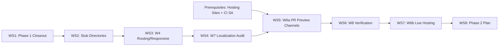

# Plan: Phase 1 Closeout + Web Lane Completion

Status: proposed
Owner: (assign)
Last updated: 2026-04-19
Revision: 2 — resolved GPS, hosting, and CI secret decisions; propagated into workstreams.

## Goal

Complete the Phase 1 enrollment flow end-to-end (enrollment callable, QR signing, consent ledger, Firestore rules, audit trail), land the remaining web support phases (W4, W6a, W6b, W7, W8), create Phase 2–6 stub directories with router guards, and produce a detailed Phase 2 plan document — all without breaking CI or deploying to prod without human review.

## Non-goals

- Implementing any Phase 2–6 feature logic (services board, progressive profile, blog authoring, community watch, training modules).
- Golden image tests for web screens.
- iOS App Check or iOS build support.
- PWA install prompt or offline shell beyond Firestore persistence.
- Replacing mobile as the primary runtime.
- Web equivalents for on-device ML (face detection).
- Coverage threshold gating in CI (requires excludes list first per `CLAUDE.md` CI rules).

---

## Resolved Decisions

### RD-1 GPS on enrollment: soft-required

- **Decision**: GPS is ON by default. If the user denies location permission or manually toggles GPS off, show a confirmation dialog (localized) and allow them to proceed without GPS.
- **Callable impact**: `enrollment.createHousehold` accepts `gps` (geopoint or `null`) and `geohash` (string or `null`) as optional fields. If both are present, validate shape: `gps` must be a valid geopoint, `geohash` must be a non-empty string. If absent, store `null` for both.
- **Firestore rule impact**: `validHouseholdCreate()` must allow `gps` and `geohash` to be absent or `null`. If `gps` is present it must be a latlng, and `geohash` must be a non-empty string. Current rule (`firestore.rules:28-38`) does not mention `gps`/`geohash`, so absent fields already pass. A shape guard for when-present must be added.
- **Audit impact**: The server-side audit entry for `household.create` includes a `gpsProvided: bool` field in the `details` map.
- **Client UX**: `enrollment_screen.dart` auto-requests location on mount (toggle ON). If denied, shows a confirmation dialog with keys `enrollment_gps_denied_title`, `enrollment_gps_denied_body`, `enrollment_gps_skip_button`, `enrollment_gps_retry_button`. User may skip or retry.
- **ARB keys**: four new keys added under WS4 (W7). See Workstream 4 for the full list.
- **Source**: `hayati-architecture.md` §3 Phase 1 ("Auto GPS stamp on save"), §5.2 (`gps: geopoint`, `geohash: string`).

### RD-2 Hosting sites: create new sites

- **Decision**: Hosting sites do not exist yet. Create them as a one-time human-run setup step before WS5.
- **Commands**:
  ```
  firebase hosting:sites:create hayati-dev --project haya-by-faith
  firebase hosting:sites:create hayati-staging --project hayati-staging-20260408
  firebase hosting:sites:create hayati-prod --project hayati-prod-20260408
  ```
  Then apply targets:
  ```
  firebase target:apply hosting dev hayati-dev -P dev
  firebase target:apply hosting staging hayati-staging -P staging
  firebase target:apply hosting prod hayati-prod -P prod
  ```
  Targets stored in `.firebaserc`.
- **Fallback**: If `hayati-dev/staging/prod` is taken globally, use `elhaya-hayati-{env}` as the site ID.
- **Runbook**: Document the creation + target commands in `docs/runbooks/firebase-setup.md` under a new "## Hosting Site Setup" section.
- **WS5 impact**: Preview channels deploy to the `hayati-staging` site.
- **WS7 impact**: Deploy scripts reference the target names `dev`, `staging`, `prod`.

### RD-3 CI secret: service account JSON key

- **Decision**: Use a dedicated service account JSON key (not `firebase login:ci` token) for CI hosting deploys.
- **Setup**:
  1. Create service account `gh-actions-hosting@<project>.iam.gserviceaccount.com` in the staging project (and later prod).
  2. Grant roles: `roles/firebasehosting.admin`, `roles/serviceusage.serviceUsageConsumer`.
  3. Generate JSON key, base64-encode, store as GitHub Actions secret `FIREBASE_SERVICE_ACCOUNT_STAGING`.
  4. Rotation policy: regenerate every 90 days; delete old key immediately after rotation.
- **CI impact**: The `build-web-preview` job in `ci.yml` uses `FirebaseExtended/action-hosting-deploy@v0` with `firebaseServiceAccount: ${{ secrets.FIREBASE_SERVICE_ACCOUNT_STAGING }}`. No `--token` flag.
- **Security**: Service account has minimum permissions (hosting only). Key rotation is an ongoing operational task documented in the runbook. Never commit the JSON key to the repo.

---

## Workstream 1 — Phase 1 Closeout (critical path)

### Exit criteria

- [ ] `enrollment.createHousehold` callable exists in `functions/src/enrollment.js`, passes unit tests, and is exported from `functions/src/index.js`.
- [ ] Callable validates shape per §5.2, creates `households/{uid}`, sets `villageId`, accepts optional `gps`/`geohash` (soft-required per RD-1), calls `signQrToken` internally, sets custom claim `{ role: "resident", villageIds: [villageId] }` via Admin SDK, writes an audit entry to `audit_log` with `gpsProvided: bool`.
- [ ] `lib/features/enrollment/screens/enrollment_screen.dart` calls the callable via `cloud_functions`, receives the signed QR token, and navigates to success screen. Auto-requests GPS on mount; shows skip dialog on deny (RD-1).
- [ ] `consent_screen.dart` writes a versioned consent entry to `households/{householdId}/consents/{consentId}` with `scope: "privacy_v1"` and `version: 1` before navigating to enrollment.
- [ ] `firestore.rules` `validHouseholdCreate()` updated: `gps`/`geohash` may be absent or `null`; if `gps` is present it must be a latlng and `geohash` must be a non-empty string. Rule change ships with matching rules-tests in the same commit.
- [ ] `rules-tests/` has new test cases: household create (allow + deny for missing fields, allow with GPS, allow without GPS, deny with GPS but missing geohash), consent create/read/update deny.
- [ ] Cloud Functions unit tests cover: valid enrollment with GPS, valid enrollment without GPS, duplicate enrollment rejection, invalid shape rejection, audit entry `gpsProvided` field.
- [ ] `flutter test` and `cd rules-tests && npm test` and `cd functions && npm test` all green.

### Steps

| # | Action | File(s) | Depends on |
|---|--------|---------|------------|
| 1.1 | Create `enrollment.createHousehold` callable. Validate shape per §5.2 (`villageId`, `name`, `householdSize`, `address`, `comment`). Accept optional `gps` (object with `latitude`/`longitude` numbers or `null`) and `geohash` (string or `null`). If `gps` is non-null, validate that `geohash` is also non-null and non-empty; reject if `gps` is present but `geohash` is absent. Call `admin.firestore()` to create `households/{uid}`. Set `ownerUid`, `villageId`, `gps` (GeoPoint or `null`), `geohash` (string or `null`), `schemaVersion: 1`, `createdAt: serverTimestamp`, `updatedAt: serverTimestamp`. Call `admin.auth().setCustomUserClaims(uid, { role: 'resident', villageIds: [villageId] })`. Call `signQrTokenHandler` internally (reuse existing code in `signQrToken.js`) to issue a token and set `qrTokenId` on the household doc. Write audit entry via `createAuditEntry` with `action: "household.create"` and `details: { gpsProvided: gps != null }`. Return `{ ok, qrToken, householdId }`. | `functions/src/enrollment.js`, `functions/src/index.js` | None |
| 1.2 | Add rate limiting to enrollment callable: 5 enrollments per uid per hour (prevents re-enrollment spam). Reuse the pattern from `signQrToken.js` `enforceQrRateLimit`. | `functions/src/enrollment.js` | 1.1 |
| 1.3 | Add idempotency guard: if `households/{uid}` already exists and `ownerUid == uid`, return the existing QR token instead of creating a duplicate. This handles retry-after-timeout. | `functions/src/enrollment.js` | 1.1 |
| 1.4 | Write unit tests for enrollment callable: valid creation with GPS, valid creation without GPS (`gps: null, geohash: null`), duplicate (idempotent return), invalid shape (missing name, bad householdSize, `gps` present but `geohash` missing), unauthenticated rejection, audit entry written with correct `gpsProvided` boolean. | `functions/src/enrollment.test.js` (or extend `functions/src/index.test.js`) | 1.1 |
| 1.5 | Wire `enrollment_screen.dart` to call `enrollment.createHousehold` via `cloud_functions`. Auto-request GPS permission on mount via `geolocator`. If permission denied or user toggles GPS off, show a confirmation dialog using `context.l('enrollment_gps_denied_title')` / `context.l('enrollment_gps_denied_body')` with buttons `context.l('enrollment_gps_skip_button')` and `context.l('enrollment_gps_retry_button')`. If skipped, send `gps: null, geohash: null` to the callable. On success, navigate to `/enrollment/success` with the QR token. Add `if (!mounted) return;` guard before navigation and before showing the GPS dialog. Show localized error on failure via `context.l('enrollment_error')`. Use `AppLogger` for error logging. | `lib/features/enrollment/screens/enrollment_screen.dart`, `lib/core/services/qr_service.dart` (if it exists, otherwise inline) | 1.1 |
| 1.6 | Wire `consent_screen.dart` to write a consent entry to `households/{uid}/consents/{auto}` with fields: `scope: "privacy_v1"`, `version: 1`, `grantedAt: FieldValue.serverTimestamp()`, `grantedByUid: currentUser.uid`, `onBehalfOfUid: currentUser.uid`, `evidence: { method: "otp" }`, `revokedAt: null`, `schemaVersion: 1`. Navigate to `/enrollment` only after the write succeeds. Add `if (!mounted) return;` guard. | `lib/features/onboarding/screens/consent_screen.dart` | None |
| 1.7 | Add rules-tests for household `create`: allow when `householdId == uid` and all shape fields valid (with GPS); allow when GPS fields are absent; deny when `householdId != uid`; deny when `role` field is present in the write; deny when `qrTokenId` field is present; deny when `gps` is present but `geohash` is absent. | `rules-tests/enrollment.test.js` (new file) | 1.10 |
| 1.8 | Add rules-tests for consent `create`: allow when `uid == householdId`; allow when caller is `data_collector` in same village; deny for resident in different household; deny for unauthenticated. | `rules-tests/enrollment.test.js` | None |
| 1.9 | Add rules-tests for consent `read`: allow owner; allow village admin; deny cross-village admin. | `rules-tests/enrollment.test.js` | None |
| 1.10 | Update `firestore.rules` `validHouseholdCreate()` to add GPS shape guard: if `gps` key is present in the write data and is not `null`, it must pass `is latlng` and `geohash` must be a non-empty string. If `gps` is absent or `null`, allow. This is a rule change and MUST ship with the rules-tests from step 1.7 in the same commit per `CLAUDE.md` Firestore Rules Change Policy. | `firestore.rules` | None |

### Rules / rules-tests impact

- **Rule change**: `firestore.rules` `validHouseholdCreate()` gains a conditional GPS shape check:
  ```
  // Existing checks ...
  && (!('gps' in d) || d.gps == null ||
      (d.gps is latlng && 'geohash' in d && d.geohash is string && d.geohash.size() > 0))
  ```
  This ships in the same commit as `rules-tests/enrollment.test.js`.
- New file: `rules-tests/enrollment.test.js` with ~10 test cases covering household create (with/without GPS, deny cases), consent create/read/update deny.

### ARB keys introduced

| Key | AR | EN |
|-----|----|----|
| `enrollment_error` | `حدث خطأ أثناء التسجيل. حاول مرة أخرى.` | `An error occurred during enrollment. Please try again.` |
| `enrollment_saving` | `جارٍ حفظ بياناتك...` | `Saving your information...` |
| `consent_saving` | `جارٍ حفظ الموافقة...` | `Saving consent...` |
| `consent_error` | `تعذر حفظ الموافقة. حاول مرة أخرى.` | `Could not save consent. Please try again.` |

(GPS dialog keys are listed under WS4 per RD-1.)

### AppLogger / audit entries

- `AppLogger.info('enrollment_started', { villageId })` — client, on form submit.
- `AppLogger.info('enrollment_completed', { householdId })` — client, on callable success.
- `AppLogger.info('enrollment_gps_skipped', { villageId })` — client, when user skips GPS dialog.
- `AppLogger.error('enrollment_failed', { error })` — client, on callable failure.
- Audit entry (server): `action: "household.create"`, `actorType: "function"`, `resourceType: "household"`, `resourceId: householdId`, `details: { gpsProvided: bool }`.
- Audit entry (server): `action: "qr.issue"`, `actorType: "function"`, `resourceType: "household"`, `resourceId: householdId`.
- Audit entry (server): `action: "claims.set"`, `actorType: "function"`, `resourceType: "user"`, `resourceId: uid`.

### Rollback

- Revert the `functions/src/enrollment.js` commit and re-export from `index.js`.
- Revert client-side enrollment wiring in `enrollment_screen.dart` and `consent_screen.dart` back to stub navigation.
- Revert the `validHouseholdCreate()` GPS guard in `firestore.rules`.
- `rules-tests/enrollment.test.js` can remain (no harm from extra tests).
- No Firestore data migration required — households created during testing can be deleted from dev/staging Firestore console.

### Effort estimate

**3.5–4.5 developer-days** (callable + GPS soft-require client UX + consent write + rules change + rules-tests + function tests + ARB keys).

---

## Workstream 2 — Phase 2–6 Stub Directories

### Exit criteria

- [ ] Directories exist: `lib/features/services/`, `lib/features/profile/`, `lib/features/blog/`, `lib/features/community_watch/`, `lib/features/training/`.
- [ ] Each directory contains a `README.md` stating "Phase N — not implemented yet (see `hayati-architecture.md` §3)".
- [ ] `lib/features/admin/` already exists with screens — no change needed there, but a `README.md` noting admin is partially implemented in Phase 1 may be added.
- [ ] `app_router.dart` has routes for `/services`, `/profile`, `/blog`, `/community-watch`, `/training` that render a localized "coming soon" placeholder when the corresponding phase flag is off.
- [ ] Phase gate uses `PhaseGate` widget or an inline check against the village's `phaseConfig`.

### Steps

| # | Action | File(s) | Depends on |
|---|--------|---------|------------|
| 2.1 | Create stub directories with README files. | `lib/features/services/README.md`, `lib/features/profile/README.md`, `lib/features/blog/README.md`, `lib/features/community_watch/README.md`, `lib/features/training/README.md` | None |
| 2.2 | Create a shared `PhasePlaceholderScreen` widget that displays `context.l('phase_locked_title')` and `context.l('phase_locked_body')`. These keys already exist in ARB + localization.dart. | `lib/core/widgets/phase_placeholder_screen.dart` (new) | None |
| 2.3 | Add stub routes to `app_router.dart` for each phase path. Each route renders `PhasePlaceholderScreen` unconditionally for now (the phase flag check can be added when the feature is implemented; routing to the placeholder is the "off" behavior). | `lib/routing/app_router.dart` | 2.2 |
| 2.4 | Add widget test: `PhasePlaceholderScreen` renders localized text. | `test/phase_placeholder_screen_test.dart` | 2.2 |

### Rules / rules-tests impact

None.

### ARB keys introduced

None — reuses existing `phase_locked_title` and `phase_locked_body`.

### Rollback

Delete the stub directories and revert the router changes.

### Effort estimate

**0.5 developer-day.**

---

## Workstream 3 — Web W4: Routing, RTL, Responsive Shell

### Exit criteria

- [ ] `usePathUrlStrategy()` call verified in `main_dev.dart`, `main_staging.dart`, `main_prod.dart` (already present per W0 — verification only).
- [ ] 404 / not-found route exists in `app_router.dart` using `errorBuilder` (already present — verification only; confirmed in current code at `app_router.dart:23-33`).
- [ ] `lib/core/theme/responsive.dart` exists with breakpoints: phone (<600), tablet (600–1024), desktop (>1024).
- [ ] Breakpoints are used in at least one layout (e.g. `resident_home_screen.dart` or a new `ResponsiveScaffold` wrapper).
- [ ] 48dp minimum touch targets, RTL, `maxLines`, `TextOverflow.ellipsis`, `mainAxisSize: MainAxisSize.min` are preserved in all existing screens.
- [ ] No new golden tests this phase.

### Steps

| # | Action | File(s) | Depends on |
|---|--------|---------|------------|
| 3.1 | Verify `usePathUrlStrategy()` calls in entrypoints (already done in W0). Document as shipped. | `lib/main_dev.dart`, `lib/main_staging.dart`, `lib/main_prod.dart` | None |
| 3.2 | Verify `errorBuilder` in `app_router.dart` (already present). Document as shipped. | `lib/routing/app_router.dart` | None |
| 3.3 | Create `lib/core/theme/responsive.dart` with `Breakpoint` enum and `ResponsiveValue<T>` helper. Define `kPhoneMaxWidth = 600`, `kTabletMaxWidth = 1024`. Provide a `BuildContext` extension: `context.isPhone`, `context.isTablet`, `context.isDesktop`. | `lib/core/theme/responsive.dart` (new) | None |
| 3.4 | Apply responsive breakpoints to `resident_home_screen.dart`: on tablet+, show a two-column layout (QR card + blog feed side by side). Keep single column on phone. Preserve 48dp targets and RTL. | `lib/features/home/screens/resident_home_screen.dart` | 3.3 |
| 3.5 | Audit all existing screens for `maxLines`, `TextOverflow.ellipsis`, `mainAxisSize: MainAxisSize.min` compliance. Fix any violations. | All screens under `lib/features/` | None |

### Dependencies on other workstreams

- None. W4 can proceed in parallel with Workstream 1 and 2.

### Rules / rules-tests impact

None.

### ARB keys introduced

None — `not_found_title` and `not_found_body` already exist in `localization.dart` but are **missing from `app_ar.arb` and `app_en.arb`**. They must be added to bring the ARB files into sync with the inline map. This is a **gap discovered during planning**.

| Key | AR | EN |
|-----|----|----|
| `not_found_title` | `الصفحة غير موجودة` | `Page not found` |
| `not_found_body` | `الرابط الذي فتحته غير متاح داخل التطبيق.` | `The link you opened is not available in the app.` |

(Values already in `localization.dart`; the ARB files need to catch up.)

### Rollback

Revert `responsive.dart` and any layout changes in home screens.

### Effort estimate

**1 developer-day** (mostly the responsive layout + audit).

---

## Workstream 4 — Web W7: Localization Audit

### Exit criteria

- [ ] `app_ar.arb` and `app_en.arb` contain every key present in `_phase1L10n` in `localization.dart`.
- [ ] Any new keys introduced by Workstreams 1, 2, and 3 are present in both ARB files.
- [ ] GPS dialog keys from RD-1 are present in both ARB files and wired via `context.l(...)`.
- [ ] `context.l(...)` mapping in `localization.dart` is updated for any new keys.
- [ ] `ci.yml` ARB parity check passes.

### Steps

| # | Action | File(s) | Depends on |
|---|--------|---------|------------|
| 4.1 | Add `not_found_title` and `not_found_body` to both ARB files (gap from W0). | `lib/l10n/app_ar.arb`, `lib/l10n/app_en.arb` | None |
| 4.2 | Add all Workstream 1 ARB keys (`enrollment_error`, `enrollment_saving`, `consent_saving`, `consent_error`) to both ARB files and to `_phase1L10n` in `localization.dart`. | `lib/l10n/app_ar.arb`, `lib/l10n/app_en.arb`, `lib/core/utils/localization.dart` | WS1 |
| 4.3 | Add GPS dialog ARB keys from RD-1 (`enrollment_gps_denied_title`, `enrollment_gps_denied_body`, `enrollment_gps_skip_button`, `enrollment_gps_retry_button`) to both ARB files and to `_phase1L10n` in `localization.dart`. | `lib/l10n/app_ar.arb`, `lib/l10n/app_en.arb`, `lib/core/utils/localization.dart` | WS1 |
| 4.4 | Add any "coming soon" or responsive-specific keys if introduced by WS2/WS3 (none expected). | — | WS2, WS3 |
| 4.5 | Run the ARB parity check from `ci.yml` locally to confirm. | Terminal | 4.1, 4.2, 4.3 |

### Full list of ARB keys introduced by this workstream

| Key | AR | EN |
|-----|----|----|
| `not_found_title` | `الصفحة غير موجودة` | `Page not found` |
| `not_found_body` | `الرابط الذي فتحته غير متاح داخل التطبيق.` | `The link you opened is not available in the app.` |
| `enrollment_error` | `حدث خطأ أثناء التسجيل. حاول مرة أخرى.` | `An error occurred during enrollment. Please try again.` |
| `enrollment_saving` | `جارٍ حفظ بياناتك...` | `Saving your information...` |
| `consent_saving` | `جارٍ حفظ الموافقة...` | `Saving consent...` |
| `consent_error` | `تعذر حفظ الموافقة. حاول مرة أخرى.` | `Could not save consent. Please try again.` |
| `enrollment_gps_denied_title` | `تحديد الموقع غير متاح` | `Location unavailable` |
| `enrollment_gps_denied_body` | `الموقع الجغرافي يساعدنا في تقديم خدمات أفضل لقريتك. يمكنك المتابعة بدون تحديد الموقع.` | `Location helps us deliver better services to your village. You can continue without it.` |
| `enrollment_gps_skip_button` | `متابعة بدون موقع` | `Continue without location` |
| `enrollment_gps_retry_button` | `المحاولة مرة أخرى` | `Try again` |

### Dependencies on other workstreams

- Must run **after** Workstreams 1, 2, 3 so all new keys are known.

### Rules / rules-tests impact

None.

### Rollback

Revert ARB file changes and `localization.dart` mapping additions.

### Effort estimate

**0.5 developer-day.**

---

## Workstream 5 — Web W6a: PR Preview Channels in CI

### Prerequisites (one-time human setup before this workstream)

Per RD-2 and RD-3, the following must be completed before WS5 begins:

1. **Create hosting sites** (RD-2):
   ```bash
   firebase hosting:sites:create hayati-dev --project haya-by-faith
   firebase hosting:sites:create hayati-staging --project hayati-staging-20260408
   firebase hosting:sites:create hayati-prod --project hayati-prod-20260408
   firebase target:apply hosting dev hayati-dev -P dev
   firebase target:apply hosting staging hayati-staging -P staging
   firebase target:apply hosting prod hayati-prod -P prod
   ```
   If `hayati-{env}` is globally taken, fall back to `elhaya-hayati-{env}`.

2. **Create CI service account** (RD-3):
   ```bash
   gcloud iam service-accounts create gh-actions-hosting \
     --display-name="GitHub Actions Hosting Deploy" \
     --project=hayati-staging-20260408
   gcloud projects add-iam-policy-binding hayati-staging-20260408 \
     --member="serviceAccount:gh-actions-hosting@hayati-staging-20260408.iam.gserviceaccount.com" \
     --role="roles/firebasehosting.admin"
   gcloud projects add-iam-policy-binding hayati-staging-20260408 \
     --member="serviceAccount:gh-actions-hosting@hayati-staging-20260408.iam.gserviceaccount.com" \
     --role="roles/serviceusage.serviceUsageConsumer"
   gcloud iam service-accounts keys create /tmp/gh-hosting-key.json \
     --iam-account=gh-actions-hosting@hayati-staging-20260408.iam.gserviceaccount.com
   base64 /tmp/gh-hosting-key.json  # copy output as FIREBASE_SERVICE_ACCOUNT_STAGING secret
   rm /tmp/gh-hosting-key.json
   ```
   Store the base64-encoded JSON as GitHub Actions secret `FIREBASE_SERVICE_ACCOUNT_STAGING`.

3. **Document both in the runbook** (`docs/runbooks/firebase-setup.md`):
   - New section "## Hosting Site Setup" with the creation + target commands.
   - New section "## CI Service Account for Hosting" with the service account setup and rotation policy (90-day rotation; delete old key immediately).

### Exit criteria

- [ ] `.github/workflows/ci.yml` has a new `build-web-preview` job that runs on PRs only.
- [ ] The job builds `flutter build web --release --dart-define=FLAVOR=dev`.
- [ ] After build, deploys to a preview channel on the `hayati-staging` site using `FirebaseExtended/action-hosting-deploy@v0` with `firebaseServiceAccount: ${{ secrets.FIREBASE_SERVICE_ACCOUNT_STAGING }}`.
- [ ] The action posts the preview URL as a PR comment automatically (built-in behavior of the action).
- [ ] The preview channel does NOT replace the live staging site.
- [ ] `FIREBASE_SERVICE_ACCOUNT_STAGING` secret and rotation policy documented in `docs/runbooks/firebase-setup.md`.

### Steps

| # | Action | File(s) | Depends on |
|---|--------|---------|------------|
| 5.1 | Add `build-web-preview` job to `ci.yml`. Condition: `if: github.event_name == 'pull_request'`. Steps: checkout, flutter setup, `flutter build web --release --dart-define=FLAVOR=dev`. Then use `FirebaseExtended/action-hosting-deploy@v0` with `repoToken: ${{ secrets.GITHUB_TOKEN }}`, `firebaseServiceAccount: ${{ secrets.FIREBASE_SERVICE_ACCOUNT_STAGING }}`, `projectId: hayati-staging-20260408`, `channelId: pr-${{ github.event.pull_request.number }}`, `expires: 7d`, `target: staging`. The action auto-comments the preview URL on the PR. | `.github/workflows/ci.yml` | Prerequisites above |
| 5.2 | Document the hosting site creation (RD-2), CI service account setup (RD-3), and secret rotation policy in the runbook. | `docs/runbooks/firebase-setup.md` | None |
| 5.3 | Test by opening a PR on the `feat/firebase-wiring` branch or a new test branch. Verify the preview deploys and the comment appears. | Manual | 5.1, 5.2 |

### Dependencies on other workstreams

- **Prerequisite setup** (RD-2, RD-3) must be completed by a human before this workstream.
- Preview channels are most useful after W4 (routing/responsive) is landed so previews show meaningful content.

### Rules / rules-tests impact

None.

### ARB keys introduced

None.

### Rollback

Remove the `build-web-preview` job from `ci.yml`. Preview channels auto-expire after 7 days. Service account can remain (no harm if unused).

### Effort estimate

**0.75 developer-day** (CI job + runbook documentation, excluding the one-time human setup).

---

## Workstream 6 — Web W8: Verification Gate

### Exit criteria

- [ ] CI gates pass: `flutter analyze --fatal-warnings --fatal-infos`, `flutter test --coverage`, `cd rules-tests && npm test`, `cd functions && npm test`, `flutter build web --release --dart-define=FLAVOR=dev`, `flutter build web --release --dart-define=FLAVOR=staging` (with dart-defines from secrets or dummy values for CI), `flutter build web --release --dart-define=FLAVOR=prod` (same).
- [ ] Manual Chrome + Safari iPad smoke test completed per checklist (see below).
- [ ] Results recorded in `docs/runbooks/firebase-setup.md` under a new "## Web Verification Log" section.

### Manual smoke checklist

Per `plans/web-support.md` §W8:

1. Phone OTP round trip on `127.0.0.1:5000` (reCAPTCHA visible) — Chrome and Safari iPad.
2. Village picker loads with offline cache (reload while offline) — Chrome.
3. Resident / staff / super_admin home render RTL without overflow at 360x640, 768x1024, 1440x900 — Chrome DevTools responsive mode.
4. Text scale 1.0, 1.5, 2.0 — Chrome accessibility settings.
5. QR display works; QR scan shows graceful fallback if camera permission denied — Chrome.
6. Consent screen submits and navigates — Chrome.
7. Enrollment form submits to callable, success screen shows QR — Chrome.
8. **Enrollment with GPS denied**: skip dialog appears, user proceeds, household created with `gps: null` — Chrome (RD-1).
9. **Enrollment with GPS allowed**: household created with valid `gps` and `geohash` — Chrome (RD-1).

### Steps

| # | Action | File(s) | Depends on |
|---|--------|---------|------------|
| 6.1 | Ensure CI already runs all required checks. Current `ci.yml` already has: format, analyze, ARB parity, test, APK build, web build. Verify `functions` and `rules` jobs are present (confirmed). No CI changes needed unless multi-flavor web builds are desired. | `.github/workflows/ci.yml` | WS1, WS3, WS4, WS5 |
| 6.2 | Run manual smoke test in Chrome + Safari iPad, including GPS skip/allow scenarios from RD-1. Record pass/fail for each item. | Manual | WS1, WS3 |
| 6.3 | Add "## Web Verification Log" section to `docs/runbooks/firebase-setup.md` with a table: test item, browser, result, date, tester. | `docs/runbooks/firebase-setup.md` | 6.2 |
| 6.4 | Fix any overflow, RTL, or text-scale issues found during smoke. | Various `lib/features/` files | 6.2 |

### Dependencies on other workstreams

- Depends on WS1 (enrollment callable + GPS UX), WS3 (responsive), WS4 (localization), WS5 (preview channels — to test the preview URL).

### Rules / rules-tests impact

None (verification only).

### ARB keys introduced

None.

### Rollback

N/A — verification is a gate, not a code change.

### Effort estimate

**1 developer-day** (manual testing + fixing issues found).

---

## Workstream 7 — Web W6b: Live Hosting Deploys

### Exit criteria

- [ ] `scripts/deploy-staging.sh` includes `firebase deploy --only hosting -P staging` (already present in current code — `hosting` is included in the existing `--only` flag). Verify and confirm.
- [ ] `scripts/deploy-prod.sh` includes `firebase deploy --only hosting -P prod` (already present). Verify and confirm.
- [ ] `.firebaserc` has hosting targets configured per RD-2: `dev` → `hayati-dev`, `staging` → `hayati-staging`, `prod` → `hayati-prod`.
- [ ] `firebase.json` updated to use hosting targets (array of hosting configs with `target` fields).
- [ ] Deploy scripts reference the correct target names.
- [ ] Preview vs live flow documented in `docs/runbooks/firebase-setup.md`.
- [ ] Prod deploy is gated on: `--i-really-mean-it` flag, `main` branch check, `preflight.sh` (which runs rules-tests), `firestore.rules` tag. Web bundle tag added.

### Steps

| # | Action | File(s) | Depends on |
|---|--------|---------|------------|
| 7.1 | Verify `deploy-staging.sh` already deploys hosting (confirmed: `--only firestore:rules,firestore:indexes,functions,hosting`). Document as shipped. | `scripts/deploy-staging.sh` | None |
| 7.2 | Verify `deploy-prod.sh` already deploys hosting (confirmed: same pattern). Document as shipped. | `scripts/deploy-prod.sh` | None |
| 7.3 | Verify `.firebaserc` has hosting targets from the RD-2 prerequisite setup (targets should have been applied during the WS5 prerequisite step). If not yet applied, run `firebase target:apply` commands with site IDs `hayati-dev`, `hayati-staging`, `hayati-prod` (or the `elhaya-hayati-{env}` fallback). | `.firebaserc` | RD-2 prerequisite |
| 7.4 | Update `firebase.json` hosting section from a single object to an array of hosting configs with `target` fields. Each entry targets one flavor site, shares the same `public`, `ignore`, `rewrites`, and `headers` config. | `firebase.json` | 7.3 |
| 7.5 | Add `git tag` step for web bundle to both deploy scripts: `git tag -a "web-staging-$(date +%Y%m%d-%H%M%S)" -m "Web staging deploy"` / equivalent for prod. | `scripts/deploy-staging.sh`, `scripts/deploy-prod.sh` | None |
| 7.6 | Document hosting target setup, preview vs live flow, rollback (`firebase hosting:clone` or console rollback), and the relationship between preview channels (WS5) and live deploys (WS7) in the runbook. | `docs/runbooks/firebase-setup.md` | 7.3, 7.4, 7.5 |

### Dependencies on other workstreams

- Must pass W8 verification gate before deploying live to staging/prod.
- Hosting sites must exist (RD-2 prerequisite, shared with WS5).
- Technically can be built in parallel and held until W8 passes.

### Rules / rules-tests impact

None.

### ARB keys introduced

None.

### Rollback

- Remove hosting targets from `.firebaserc`.
- Revert `firebase.json` to single hosting config.
- Roll back a shipped web release via `firebase hosting:clone <SOURCE_SITE>:<VERSION> <TARGET_SITE>:live` or Firebase Console → Hosting → Rollback.

### Effort estimate

**0.75 developer-day** (mostly `firebase.json` restructuring and documentation).

---

## Workstream 8 — Phase 2 Detailed Plan

### Exit criteria

- [ ] `plans/phase-2-services.md` exists with a complete implementation plan covering: services board UI per role, `serviceRegistration` callable, `attendanceConfirm` callable, FCM topic wiring, Firestore rules deltas, rules-tests, telemetry events, phase toggle UX.
- [ ] Plan explicitly states that implementation is deferred until `phaseConfig.phase_2_services` is flipped by super_admin and a human-reviewed design sign-off exists.
- [ ] Cross-referenced from this plan.

### Steps

| # | Action | File(s) | Depends on |
|---|--------|---------|------------|
| 8.1 | Write `plans/phase-2-services.md` covering the items listed below. | `plans/phase-2-services.md` (new) | WS1 (to understand callable patterns established) |

### Phase 2 plan contents (outline)

1. **Services board UI** — per-role views (resident sees available services, staff sees management), responsive layout per W4 breakpoints, Arabic-first, 48dp targets, offline-cached service list.
2. **`serviceRegistration` callable** — transactional registration (§5.6 `registeredCount` update), capacity check, duplicate prevention, audit entry. Located at `functions/src/serviceRegistration.js`.
3. **`attendanceConfirm` callable** — QR scan → `verifyQrToken` → village scope check → create `participations/{pid}` entry with status `attended`. Located at `functions/src/attendanceConfirm.js` (already exists as a stub — wire to full logic).
4. **FCM topic wiring** — topics: `village_{villageId}` (all residents), `village_{villageId}_service_{type}` (registered residents for that service type). Subscribe on enrollment, on service registration. Unsubscribe on cancellation.
5. **Firestore rules deltas** — `services` collection: read allowed for all authenticated users in the village; create/update allowed for admin/super_admin (already present). `participations`: read for self, staff, and service_provider (own services); write via Cloud Function only (already present). No new client write rules.
6. **Rules-tests** — new file `rules-tests/services.test.js`: service create/read by admin; participation read by resident (own), by staff, by service_provider (own service only); participation write denied for all clients.
7. **Telemetry events** — `service_registered`, `service_cancelled`, `attendance_confirmed`, `attendance_no_show`. Custom dimensions: `villageId`, `serviceType`, `role`.
8. **Phase toggle UX** — village admin toggles `phaseConfig.phase_2_services` from village settings screen (requires step-up auth). Services routes become visible once the flag is true.
9. **Deferred** — implementation begins only when: (a) super_admin flips `phaseConfig.phase_2_services` for at least one village, AND (b) a human-reviewed design sign-off exists for the services board UI.

### Rules / rules-tests impact

None (planning only).

### ARB keys introduced

None (planning only — keys will be defined in the Phase 2 plan itself).

### Rollback

Delete `plans/phase-2-services.md`.

### Effort estimate

**0.5 developer-day** (writing only, no implementation).

---

## Dependency DAG



ASCII version:

```
[Prerequisites: Hosting Sites (RD-2) + CI Service Account (RD-3)]
  └─► WS5 (W6a PR Preview Channels)

WS1 (Phase 1 Closeout)
  └─► WS2 (Stub Directories)
        └─► WS3 (W4 Routing / Responsive)
              └─► WS4 (W7 Localization Audit)
                    └─► WS5 (W6a PR Preview Channels)
                          └─► WS6 (W8 Verification Gate)
                                └─► WS7 (W6b Live Hosting Deploys)
                                      └─► WS8 (Phase 2 Plan)
```

**Parallelism opportunities:**
- WS3 (W4) can start in parallel with WS1 if enrollment callable work is on a separate branch.
- WS5 (W6a) CI changes can be drafted while WS4 (localization) is in progress, but the prerequisite setup (RD-2, RD-3) must be done first.
- WS8 (Phase 2 plan) can be written at any time, but benefits from WS1 being complete to reference established callable patterns.
- The RD-2/RD-3 prerequisite setup can happen in parallel with WS1–WS4.

---

## Risk Register

| # | Risk | Likelihood | Impact | Mitigation |
|---|------|-----------|--------|------------|
| R1 | **CSP blocking reCAPTCHA on prod hosting** — the current CSP in `firebase.json` allows `unsafe-inline` for the App Check debug snippet. A stricter CSP on prod could break reCAPTCHA verification. | Medium | High | Test reCAPTCHA on the staging preview channel with the exact CSP headers. Migrate the debug snippet to a nonce before prod deploy. See `hayati-architecture.md` §26.5. |
| R2 | **Secret Manager access binding misses** — the `enrollment.createHousehold` callable calls `signQrTokenHandler` which needs `QR_HMAC_SECRET`. If the runtime service account lacks `secretmanager.secretAccessor`, the callable will fail silently at first invocation. | Medium | High | Verify IAM binding for each project before deploying functions. Add a health-check callable that reads the secret and returns a hash. Document in `docs/runbooks/firebase-setup.md`. |
| R3 | **Preview channel cost** — each PR deploys a 7-day preview channel on the staging project. If PRs are frequent, hosting storage and CDN costs could spike. | Low | Medium | Set `--expires 7d` (already planned). Monitor Firebase Hosting usage in the console. Add a budget alert at $10/month for staging hosting. |
| R4 | **Text scale 2.0x overflow** — enrollment form fields, consent screen text, and GPS skip dialog may overflow at 2.0x scale on narrow phones (360px wide). | Medium | Medium | Use `SingleChildScrollView` on all form screens. Set `maxLines` + `TextOverflow.ellipsis` on non-scrollable text. Test GPS dialog at 2.0x during W8 smoke. |
| R5 | **Safari iPad PWA quirks** — Safari on iPad has known issues with `IndexedDB` quotas, service worker lifecycle, and `position: fixed` elements. PWA install behavior requires iOS 16.4+ and Add-to-Home-Screen. | Medium | Medium | Test specifically on Safari iPad during W8 smoke. Document known limitations in the verification log. PWA install is a non-goal for this plan. |
| R6 | **Enrollment callable race condition** — two concurrent requests for the same uid could both pass the idempotency check and create duplicate households. | Low | High | Use a Firestore transaction in the callable: check-then-write within the same transaction. The household doc ID is the uid, so `set` with `{ merge: false }` on an existing doc will fail naturally if the idempotency guard reads first within a transaction. |
| R7 | **Phone OTP failures on Egyptian networks** — reCAPTCHA v3 scoring may flag legitimate users on slow Egyptian mobile networks. | Medium | High | Use test phone numbers during dev/staging. Monitor `auth/captcha-check-failed` errors in Cloud Logging. Document the `127.0.0.1` requirement per `hayati-architecture.md` §26.3 and the troubleshooting table in `docs/runbooks/firebase-setup.md`. |
| R8 | **Hosting site ID collision** — `hayati-dev`, `hayati-staging`, `hayati-prod` may already be taken globally on Firebase Hosting (site IDs are globally unique). | Medium | Low | Fallback naming convention: `elhaya-hayati-{env}`. Attempt creation first; if it fails with "already exists", retry with the prefixed name. Document both options in the runbook. |
| R9 | **Service account key leak** — the `FIREBASE_SERVICE_ACCOUNT_STAGING` GitHub Actions secret contains a JSON key that grants hosting admin access. If the repo is forked or the secret leaks, an attacker could deploy to the staging site. | Low | High | Restrict the secret to the `build-web-preview` job. Do not expose it to fork PRs (`pull_request_target` vs `pull_request` — use `pull_request` so forks cannot access secrets). Rotate the key every 90 days per RD-3. Monitor the service account's API activity in Cloud Logging. |

---

## Rollback (summary per workstream)

| WS | Rollback procedure |
|----|--------------------|
| 1 | Revert `enrollment.js`, `index.js` exports, `enrollment_screen.dart`, `consent_screen.dart` changes. Revert `validHouseholdCreate()` GPS guard in `firestore.rules`. Keep rules-tests. |
| 2 | Delete stub directories and revert `app_router.dart`. |
| 3 | Revert `responsive.dart` and layout changes in home screens. |
| 4 | Revert ARB and `localization.dart` additions. |
| 5 | Remove `build-web-preview` job from `ci.yml`. Channels auto-expire. Service account can remain. |
| 6 | N/A (verification gate). |
| 7 | Remove hosting targets from `.firebaserc`, revert `firebase.json`. Rollback live hosting via `firebase hosting:clone` or console. |
| 8 | Delete `plans/phase-2-services.md`. |

---

## Effort Estimate (total)

| Workstream | Days |
|-----------|------|
| WS1: Phase 1 Closeout | 3.5–4.5 |
| WS2: Stub Directories | 0.5 |
| WS3: W4 Routing/Responsive | 1 |
| WS4: W7 Localization Audit | 0.5 |
| WS5: W6a PR Preview Channels | 0.75 |
| WS6: W8 Verification | 1 |
| WS7: W6b Live Hosting | 0.75 |
| WS8: Phase 2 Plan | 0.5 |
| **Total** | **8.5–9.5** |

With parallelism (WS3 alongside WS1, RD-2/RD-3 setup alongside WS1–WS4, WS8 drafted early), the critical path is approximately **6.5–7.5 developer-days**.

---

## Open Questions

1. **Who holds the initial super_admin bootstrap key?** The `scripts/bootstrap_super_admin.js` script (documented in `docs/runbooks/firebase-setup.md`) requires a Firebase Auth uid and Admin SDK credentials. Who runs this for each environment, and where are the Admin SDK credentials stored? This determines operational security posture for the first deploy.

2. **Should the enrollment consent scope be `privacy_v1` or versioned to match the actual deployed policy document?** Currently the plan hardcodes `scope: "privacy_v1"` and `version: 1`. If the foundation's lawyer revises the privacy policy before Phase 1 ships, the consent version must match. Should the version number come from a Firestore config document or be bumped via an app release?

3. **Should the dev hosting site be public or gated during pre-launch?** The `hayati-dev` Firebase Hosting site will be publicly accessible once deployed. During pre-launch, should it be restricted (e.g. Firebase Auth gating via a Cloud Function redirect, or IP allowlist via a CDN rule) to prevent accidental exposure of the dev environment to the public?

---

## Phase 1 Closeout Acceptance Checklist

This mirrors the Test plan expected in PR #7 and serves as the acceptance gate for the Phase 1 closeout milestone.

- [ ] Phone OTP sign-in completes on Android (dev flavor) and Chrome (dev flavor, `127.0.0.1:5000`).
- [ ] Consent screen writes a `privacy_v1` consent entry to `households/{uid}/consents/{id}` (verified in Firestore console).
- [ ] Enrollment form submits to `enrollment.createHousehold` callable.
- [ ] Callable creates `households/{uid}` with correct fields per §5.2.
- [ ] **With GPS allowed**: household has valid `gps` (geopoint) and `geohash` (non-empty string).
- [ ] **With GPS denied**: GPS skip dialog appears, household has `gps: null` and `geohash: null`, audit entry has `gpsProvided: false`.
- [ ] Callable sets custom claim `{ role: "resident", villageIds: [villageId] }` (verified via `admin.auth().getUser(uid).customClaims`).
- [ ] Callable issues a signed QR token and stores `qrTokenId` on the household doc.
- [ ] Callable writes an audit entry to `audit_log` with `action: "household.create"` and `details.gpsProvided` boolean.
- [ ] Success screen displays the QR code rendered from the signed token.
- [ ] QR scan → `verifyQrToken` callable returns household summary.
- [ ] `firestore.rules` deny: household create with `householdId != uid`.
- [ ] `firestore.rules` deny: household create with `role` or `qrTokenId` in the write payload.
- [ ] `firestore.rules` deny: household create with `gps` present but `geohash` missing.
- [ ] `firestore.rules` allow: household create without `gps` or with `gps: null`.
- [ ] `firestore.rules` allow: consent create by household owner.
- [ ] `firestore.rules` deny: consent delete.
- [ ] `flutter analyze --fatal-warnings --fatal-infos` clean.
- [ ] `flutter test --coverage` clean.
- [ ] `cd rules-tests && npm test` clean (including new enrollment tests with GPS scenarios).
- [ ] `cd functions && npm test` clean (including new enrollment callable tests with/without GPS).
- [ ] ARB parity check passes (including GPS dialog keys).
- [ ] Web build (`flutter build web --release --dart-define=FLAVOR=dev`) succeeds.
- [ ] No raw `print()` calls in new code.
- [ ] All new visible strings use `context.l('key')`.
- [ ] No `allow: if true` in `firestore.rules`.
- [ ] No client-side custom-claim writes.

---

## References

- `CLAUDE.md` — canonical vocabulary, roles, phase discipline, trigger safety, deployment rules, CI rules.
- `hayati-architecture.md` §3 (phase rollout), §5.2 (household schema), §5.4 (consent ledger), §6.1 (enrollment flow), §7 (signed QR), §12 (Firestore rules), §26 (Web Runtime Phase W0).
- `plans/web-support.md` — W0–W8 web plan.
- `docs/runbooks/firebase-setup.md` — deploy runbook, secret setup, phone OTP troubleshooting.
